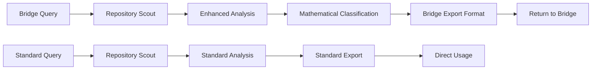

# Repository Scout - Bridge Integration Guide

**Version**: 1.0  
**Integration Target**: Research-Code Bridge  
**Last Updated**: 2025-07-10

---

## 🎯 Overview

Repository Scout is designed as a standalone AI agent-friendly repository discovery tool that can be integrated with the Research-Code Bridge system to provide computational solution discovery capabilities.

### Core Purpose
- **Primary**: Discover and rank GitHub repositories for AI agent use
- **Bridge Integration**: Provide computational solutions for mathematical problems
- **Scope**: GitHub repository analysis, scoring, and export

---

## 🔌 Bridge Integration Points

### 1. Data Export Compatibility

Repository Scout exports data in formats compatible with the Bridge system:

```python
# Bridge-compatible export format
{
    "repository_url": "https://github.com/owner/repo",
    "mathematical_capabilities": {
        "detected_methods": ["optimization", "linear_algebra"],
        "complexity_level": 7,
        "numerical_methods": ["gradient_descent", "monte_carlo"],
        "problem_domains": ["machine_learning", "scientific_computing"]
    },
    "agent_friendliness": {
        "total_score": 85.5,
        "cli_score": 90.0,
        "api_score": 80.0,
        "documentation_score": 85.0
    },
    "implementation_quality": {
        "code_quality": 0.8,
        "maintenance_score": 0.9,
        "test_coverage": 0.7
    },
    "bridge_metadata": {
        "analyzed_at": "2025-07-10T12:00:00Z",
        "scout_version": "0.1.0",
        "bridge_compatible": true
    }
}
```

### 2. Enhanced Analysis for Bridge

When integrated with the Bridge, Repository Scout provides enhanced analysis:

```python
# Enhanced analysis for mathematical repositories
class BridgeEnhancedAnalyzer(RepositoryAnalyzer):
    """Enhanced analyzer for bridge integration"""
    
    def __init__(self, github_client, bridge_config=None):
        super().__init__(github_client)
        self.bridge_config = bridge_config or {}
        
    async def analyze_mathematical_content(self, metadata):
        """Analyze repository for mathematical capabilities"""
        # Standard analysis plus mathematical focus
        standard_analysis = await self.analyze_repository(metadata)
        
        # Enhanced mathematical analysis
        math_analysis = await self._analyze_mathematical_patterns(metadata)
        
        return {
            **standard_analysis.to_dict(),
            "mathematical_analysis": math_analysis
        }
    
    async def _analyze_mathematical_patterns(self, metadata):
        """Detect mathematical patterns in repository"""
        # Look for mathematical libraries
        math_libraries = [
            "numpy", "scipy", "sympy", "tensorflow", "pytorch",
            "scikit-learn", "statsmodels", "cvxpy", "pulp"
        ]
        
        # Analyze requirements and imports
        detected_libraries = await self._detect_mathematical_libraries(
            metadata, math_libraries
        )
        
        # Analyze mathematical concepts in documentation
        math_concepts = await self._extract_mathematical_concepts(metadata)
        
        return {
            "mathematical_libraries": detected_libraries,
            "mathematical_concepts": math_concepts,
            "numerical_methods": await self._detect_numerical_methods(metadata),
            "problem_domains": await self._classify_problem_domains(metadata)
        }
```

### 3. Bridge-Specific Configuration

```python
# Bridge integration configuration
BRIDGE_CONFIG = {
    # Enhanced mathematical analysis
    "enable_mathematical_analysis": True,
    "mathematical_libraries": [
        "numpy", "scipy", "sympy", "tensorflow", "pytorch",
        "scikit-learn", "cvxpy", "pulp", "networkx", "pandas"
    ],
    
    # Problem domain classification
    "problem_domains": {
        "optimization": ["cvxpy", "pulp", "scipy.optimize"],
        "linear_algebra": ["numpy", "scipy.linalg"],
        "machine_learning": ["scikit-learn", "tensorflow", "pytorch"],
        "statistics": ["statsmodels", "scipy.stats"],
        "graph_theory": ["networkx", "igraph"],
        "numerical_analysis": ["scipy", "numpy"]
    },
    
    # Bridge export format
    "bridge_export_format": {
        "include_mathematical_analysis": True,
        "include_bridge_metadata": True,
        "compatibility_version": "1.0"
    }
}
```

---

## 🛠️ Installation for Bridge Integration

### Standard Installation
```bash
# Install Repository Scout
pip install -e .

# Install with bridge dependencies
pip install -e .[bridge]
```

### Docker Integration
```yaml
# docker-compose.yml fragment
repo-scout:
  build: 
    context: ./repo-scout
    dockerfile: Dockerfile
  environment:
    - BRIDGE_INTEGRATION_ENABLED=true
    - BRIDGE_API_URL=http://bridge-api:8000
    - BRIDGE_API_KEY=${BRIDGE_API_KEY}
  ports:
    - "5000:5000"
  networks:
    - bridge-network
```

---

## 🔧 API Integration

### Bridge-Compatible Endpoints

```python
# Enhanced CLI for bridge integration
@click.command()
@click.option('--bridge-export', is_flag=True, help='Export in bridge-compatible format')
@click.option('--mathematical-analysis', is_flag=True, help='Enable mathematical analysis')
def scout_for_bridge(bridge_export, mathematical_analysis):
    """Scout repositories with bridge integration"""
    config = Config()
    if mathematical_analysis:
        config.enable_mathematical_analysis = True
    
    # Run analysis with bridge enhancements
    results = run_enhanced_analysis(config)
    
    if bridge_export:
        export_bridge_format(results)
    else:
        export_standard_format(results)
```

### REST API Endpoints (Future)
```python
# Bridge integration endpoints
@app.post("/api/v1/analyze-for-bridge")
async def analyze_repository_for_bridge(request: BridgeAnalysisRequest):
    """Analyze repository with bridge-specific enhancements"""
    pass

@app.post("/api/v1/search-mathematical-repos")
async def search_mathematical_repositories(request: MathematicalSearchRequest):
    """Search repositories by mathematical capabilities"""
    pass
```

---

## 📊 Data Schema Compatibility

### Bridge-Compatible Data Models

```python
@dataclass
class BridgeCompatibleRepository:
    """Repository data optimized for bridge integration"""
    
    # Standard Repository Scout fields
    metadata: RepositoryMetadata
    analysis: RepositoryAnalysis
    score: RepositoryScore
    
    # Bridge-specific enhancements
    mathematical_capabilities: MathematicalCapabilities
    computational_methods: List[str]
    problem_solving_domains: List[str]
    bridge_compatibility_score: float
    
    def to_bridge_format(self) -> Dict[str, Any]:
        """Convert to bridge-compatible format"""
        return {
            "repository_url": self.metadata.url,
            "repository_id": f"rs_{self.metadata.full_name.replace('/', '_')}",
            "mathematical_capabilities": self.mathematical_capabilities.to_dict(),
            "agent_friendliness": self.score.total_score,
            "implementation_quality": self._calculate_implementation_quality(),
            "bridge_metadata": {
                "source": "repository_scout",
                "version": "0.1.0",
                "analyzed_at": datetime.now().isoformat()
            }
        }

@dataclass
class MathematicalCapabilities:
    """Mathematical capabilities of a repository"""
    detected_libraries: List[str]
    mathematical_concepts: List[str]
    numerical_methods: List[str]
    problem_domains: List[str]
    complexity_level: int
    mathematical_rigor_score: float
    
    def to_dict(self) -> Dict[str, Any]:
        return {
            "detected_libraries": self.detected_libraries,
            "mathematical_concepts": self.mathematical_concepts,
            "numerical_methods": self.numerical_methods,
            "problem_domains": self.problem_domains,
            "complexity_level": self.complexity_level,
            "mathematical_rigor_score": self.mathematical_rigor_score
        }
```

---

## 🔄 Workflow Integration

### Bridge Integration Workflow



### Example Integration Flow

```python
# Example bridge integration workflow
async def bridge_integration_workflow():
    """Example workflow for bridge integration"""
    
    # 1. Receive mathematical problem from bridge
    mathematical_problem = await receive_from_bridge()
    
    # 2. Extract search criteria
    search_criteria = extract_search_criteria(mathematical_problem)
    
    # 3. Search repositories with enhanced analysis
    async with RepositoryScout() as scout:
        results = []
        async for repo in scout.scout_repositories(
            query=search_criteria.query,
            max_repositories=search_criteria.max_results,
            min_score=search_criteria.min_score
        ):
            # Enhanced analysis for mathematical content
            enhanced_analysis = await analyze_mathematical_content(repo)
            if enhanced_analysis.mathematical_score > 0.7:
                results.append(repo.to_bridge_format())
    
    # 4. Return to bridge
    return results
```

---

## 🎨 Style Guide Compliance

### Code Style
- **Formatter**: Black (line length: 88)
- **Linting**: flake8 with bridge-specific rules
- **Type Hints**: Required for all public APIs
- **Docstrings**: Google-style docstrings

### API Design
- **Naming**: snake_case for functions, PascalCase for classes
- **Error Handling**: Structured error responses
- **Authentication**: Bearer token support for bridge integration
- **Rate Limiting**: Respect GitHub API limits

### Documentation
- **Format**: Markdown with mermaid diagrams
- **Structure**: Bridge-compatible section in all docs
- **Examples**: Include bridge integration examples
- **Versioning**: Semantic versioning with bridge compatibility notes

---

## 🧪 Testing

### Bridge Integration Tests

```python
class TestBridgeIntegration:
    """Test suite for bridge integration"""
    
    @pytest.mark.asyncio
    async def test_mathematical_analysis(self):
        """Test mathematical content analysis"""
        # Test mathematical library detection
        # Test concept extraction
        # Test problem domain classification
        pass
    
    @pytest.mark.asyncio
    async def test_bridge_export_format(self):
        """Test bridge-compatible export format"""
        # Test data format compatibility
        # Test required fields presence
        # Test metadata structure
        pass
    
    @pytest.mark.asyncio
    async def test_api_integration(self):
        """Test API integration with bridge"""
        # Test endpoint responses
        # Test error handling
        # Test authentication
        pass
```

### Quality Assurance

```bash
# Bridge integration testing
pytest tests/bridge/ -v
black --check src/
flake8 src/ --bridge-config
mypy src/ --bridge-strict
```

---

## 📋 Maintenance

### Version Compatibility
- **Bridge Version**: Track bridge system version compatibility
- **API Versioning**: Maintain backward compatibility
- **Data Format**: Evolution strategy for data schema changes

### Monitoring
- **Performance**: Track analysis performance for bridge queries
- **Usage**: Monitor bridge integration usage patterns
- **Errors**: Log bridge-specific errors and issues

### Updates
- **Bridge Updates**: Coordinate updates with bridge system
- **Dependencies**: Manage shared dependencies
- **Documentation**: Keep integration docs up to date

---

## 🚀 Future Enhancements

### Planned Features
1. **Real-time Integration**: WebSocket connections with bridge
2. **Advanced Mathematical Analysis**: ML-based mathematical concept extraction
3. **Collaborative Filtering**: Learn from bridge usage patterns
4. **Multi-source Integration**: Beyond GitHub (GitLab, etc.)

### Research Directions
- **Automated Problem Classification**: AI-powered problem type detection
- **Solution Quality Prediction**: Predict implementation success
- **Gap Analysis**: Identify missing implementations
- **Trend Analysis**: Predict future implementation needs

---

## 📞 Support

### Bridge Integration Support
- **Documentation**: This guide and API documentation
- **Issues**: GitHub issues with `bridge-integration` label
- **Community**: Bridge developer community forum
- **Professional**: Enterprise support for bridge deployments

### Contact Information
- **Bridge Team**: bridge-support@example.com
- **Repository Scout**: repo-scout@example.com
- **Integration Issues**: integration-help@example.com

---

**This integration guide ensures Repository Scout works seamlessly with the Research-Code Bridge while maintaining its core focus on GitHub repository analysis.**