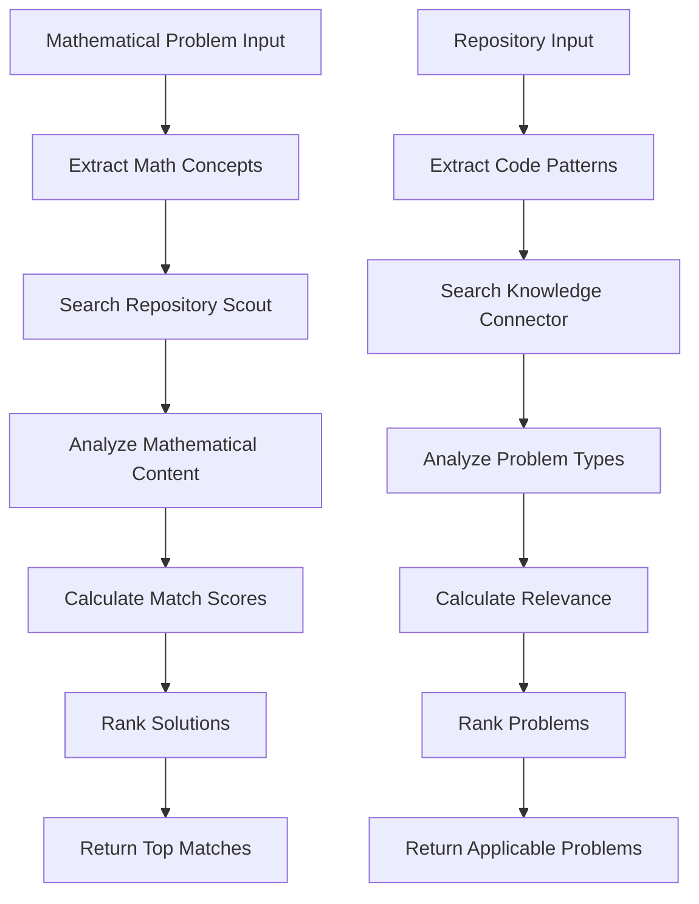

# Research-Code Bridge Specification

**Version**: 1.0  
**Date**: 2025-07-10  
**Purpose**: Comprehensive blueprint for integrating Repository Scout and Knowledge Connector

---

## 📋 Executive Summary

### Overview
This document provides a complete specification for building a bridge system that connects **Repository Scout** (GitHub repository analysis) with **Knowledge Connector** (arXiv mathematical paper analysis). The bridge creates a unified platform for discovering connections between mathematical research and computational implementations.

### Strategic Value
- **For Researchers**: Discover computational tools that solve theoretical problems
- **For Developers**: Find mathematical problems that need implementation
- **For AI Agents**: Bridge theoretical knowledge with practical tools
- **For Innovation**: Accelerate research-to-implementation pipeline

### Key Use Cases
1. **Mathematical Problem Solver Discovery**: Find GitHub repos that solve problems from arXiv papers
2. **Research Gap Identification**: Identify mathematical areas lacking good implementations
3. **Implementation Recommendations**: Suggest code improvements based on mathematical advances
4. **Academic-Industry Bridge**: Connect theoretical research with practical applications

---

## 🏗️ Technical Architecture Analysis

### Repository Scout Architecture

```
Repository Scout (Current)
├── GitHub API Client (async, rate-limited)
├── Repository Analyzer (NLP + pattern detection)
├── Scoring Engine (agent-friendliness metrics)
├── CLI Interface (search, export, statistics)
└── Data Models (metadata, analysis, scores)

Core Capabilities:
- Repository discovery and filtering
- Code structure analysis
- Documentation quality assessment
- CLI/API detection
- License compatibility scoring
- Export to JSON/JSONL/CSV
```

### Knowledge Connector Architecture

```
Knowledge Connector (Current)
├── arXiv API Client (paper fetching)
├── Mathematical Parser (LaTeX, SymPy)
├── Multi-Model Analyzer (mathematical content)
├── Connection Discovery (cross-domain relationships)
├── FastAPI Interface (authenticated endpoints)
└── PostgreSQL + pgvector (embeddings storage)

Core Capabilities:
- Mathematical content extraction
- Cross-domain connection discovery
- Citation path analysis
- Mathematical bridge detection
- Solution transfer identification
- Vector similarity search
```

### Integration Points

| Component | Repository Scout | Knowledge Connector | Bridge Opportunity |
|-----------|------------------|---------------------|-------------------|
| **Content Analysis** | README, docs, code | Papers, abstracts, LaTeX | Mathematical concept extraction |
| **Pattern Detection** | CLI/API patterns | Mathematical entities | Problem-solution matching |
| **Scoring Systems** | Agent-friendliness | Mathematical complexity | Cross-domain relevance |
| **Vector Embeddings** | ❌ Not implemented | ✅ pgvector | Unified embedding space |
| **Search Capabilities** | GitHub search | Mathematical similarity | Cross-domain search |
| **Export Formats** | JSON/JSONL/CSV | API responses | Unified data formats |

---

## 🌉 Bridge System Design

### Core Architecture

```
Research-Code Bridge
├── Orchestration Layer
│   ├── Query Router
│   ├── Cross-Domain Matcher
│   └── Result Aggregator
├── Data Integration Layer
│   ├── Unified Data Models
│   ├── Vector Store Manager
│   └── Knowledge Graph
├── Analysis Engine
│   ├── Mathematical-Computational Matcher
│   ├── Problem-Solution Identifier
│   └── Research Gap Detector
├── AI Agent Interface
│   ├── Natural Language Query Processing
│   ├── Recommendation Engine
│   └── Workflow Automation
└── Export & Visualization
    ├── Multi-format Export
    ├── Interactive Dashboard
    └── API Endpoints
```

### Unified Data Models

```python
@dataclass
class MathematicalProblem:
    """Mathematical problem extracted from papers"""
    problem_id: str
    arxiv_id: str
    problem_type: str  # "optimization", "classification", "numerical"
    mathematical_domain: str
    complexity_level: int
    problem_statement: str
    latex_formulation: Optional[str]
    required_methods: List[str]
    embedding_vector: np.ndarray
    
@dataclass
class ComputationalSolution:
    """Computational solution from repositories"""
    solution_id: str
    repository_url: str
    solution_type: str  # "library", "algorithm", "tool"
    programming_language: str
    mathematical_methods: List[str]
    problem_domains: List[str]
    implementation_quality: float
    agent_friendliness: float
    embedding_vector: np.ndarray

@dataclass
class ProblemSolutionMatch:
    """Connection between mathematical problem and computational solution"""
    match_id: str
    problem: MathematicalProblem
    solution: ComputationalSolution
    match_confidence: float
    mathematical_overlap: List[str]
    gap_analysis: Dict[str, Any]
    adaptation_requirements: List[str]
    implementation_complexity: str  # "direct", "moderate", "complex"
    
@dataclass
class ResearchGap:
    """Identified gap between theory and implementation"""
    gap_id: str
    mathematical_area: str
    problem_frequency: int
    existing_solutions: List[ComputationalSolution]
    solution_quality_gaps: List[str]
    implementation_opportunities: List[str]
    market_potential: float
```

### Cross-Domain Matching Algorithm

```python
class MathematicalComputationalMatcher:
    def __init__(self, repo_scout, knowledge_connector):
        self.repo_scout = repo_scout
        self.knowledge_connector = knowledge_connector
        self.unified_embedding_space = UnifiedEmbeddingSpace()
        
    async def find_problem_solutions(
        self, 
        problem: MathematicalProblem,
        max_solutions: int = 20
    ) -> List[ProblemSolutionMatch]:
        """Find computational solutions for mathematical problems"""
        
        # 1. Extract mathematical concepts from problem
        math_concepts = await self.extract_mathematical_concepts(problem)
        
        # 2. Search repositories with relevant patterns
        candidate_repos = await self.repo_scout.search_repositories_by_concepts(
            mathematical_concepts=math_concepts,
            programming_languages=["python", "r", "julia", "matlab"],
            min_agent_friendliness=60.0
        )
        
        # 3. Analyze repositories for mathematical content
        analyzed_repos = []
        for repo in candidate_repos:
            analysis = await self.analyze_repository_mathematical_content(repo)
            if analysis.mathematical_score > 0.6:
                analyzed_repos.append(analysis)
        
        # 4. Calculate match scores
        matches = []
        for repo_analysis in analyzed_repos:
            match_score = self.calculate_problem_solution_match(
                problem, repo_analysis
            )
            if match_score.confidence > 0.7:
                matches.append(match_score)
        
        # 5. Rank and return top matches
        return sorted(matches, key=lambda x: x.match_confidence, reverse=True)[:max_solutions]
```

---

## 🗺️ Implementation Roadmap

### Phase 1: Core Integration Framework (4-6 weeks)

#### Week 1-2: Foundation
- [ ] Create bridge project structure
- [ ] Design unified data models
- [ ] Implement basic orchestration layer
- [ ] Create mock integrations with both systems

#### Week 3-4: Data Integration
- [ ] Implement unified embedding space
- [ ] Create cross-domain data mappers
- [ ] Build vector similarity infrastructure
- [ ] Implement basic problem-solution matching

#### Week 5-6: Testing & Validation
- [ ] Create comprehensive test suite
- [ ] Implement mock data generators
- [ ] Performance testing and optimization
- [ ] Documentation and examples

### Phase 2: Mathematical-Computational Matching (3-4 weeks)

#### Week 7-8: Advanced Matching
- [ ] Implement mathematical concept extraction
- [ ] Build sophisticated matching algorithms
- [ ] Create confidence scoring system
- [ ] Implement gap analysis

#### Week 9-10: Knowledge Graph
- [ ] Build knowledge graph infrastructure
- [ ] Implement relationship discovery
- [ ] Create graph traversal algorithms
- [ ] Build recommendation engine

### Phase 3: AI Agent Interface (2-3 weeks)

#### Week 11-12: Agent Integration
- [ ] Design agent-friendly API
- [ ] Implement natural language processing
- [ ] Create workflow automation
- [ ] Build agent plugin system

#### Week 13: Advanced Features
- [ ] Implement batch processing
- [ ] Create monitoring and analytics
- [ ] Build caching infrastructure
- [ ] Performance optimization

### Phase 4: Advanced Analytics & Visualization (2-3 weeks)

#### Week 14-15: Analytics
- [ ] Implement trend analysis
- [ ] Create market opportunity identification
- [ ] Build research impact prediction
- [ ] Create collaboration matching

#### Week 16: Visualization & Export
- [ ] Build interactive dashboard
- [ ] Implement advanced export formats
- [ ] Create visualization components
- [ ] Final testing and deployment

---

## 🔧 Technical Specifications

### Database Schema Extensions

```sql
-- Mathematical Problems Table
CREATE TABLE mathematical_problems (
    problem_id UUID PRIMARY KEY,
    arxiv_id VARCHAR(50) NOT NULL,
    problem_type VARCHAR(50) NOT NULL,
    mathematical_domain VARCHAR(100) NOT NULL,
    complexity_level INTEGER CHECK (complexity_level BETWEEN 1 AND 10),
    problem_statement TEXT NOT NULL,
    latex_formulation TEXT,
    required_methods TEXT[],
    embedding_vector vector(768),
    created_at TIMESTAMP DEFAULT NOW(),
    updated_at TIMESTAMP DEFAULT NOW()
);

-- Computational Solutions Table
CREATE TABLE computational_solutions (
    solution_id UUID PRIMARY KEY,
    repository_url VARCHAR(500) NOT NULL,
    solution_type VARCHAR(50) NOT NULL,
    programming_language VARCHAR(50) NOT NULL,
    mathematical_methods TEXT[],
    problem_domains TEXT[],
    implementation_quality DECIMAL(3,2) CHECK (implementation_quality BETWEEN 0 AND 1),
    agent_friendliness DECIMAL(3,2) CHECK (agent_friendliness BETWEEN 0 AND 1),
    embedding_vector vector(768),
    created_at TIMESTAMP DEFAULT NOW(),
    updated_at TIMESTAMP DEFAULT NOW()
);

-- Problem-Solution Matches Table
CREATE TABLE problem_solution_matches (
    match_id UUID PRIMARY KEY,
    problem_id UUID REFERENCES mathematical_problems(problem_id),
    solution_id UUID REFERENCES computational_solutions(solution_id),
    match_confidence DECIMAL(3,2) CHECK (match_confidence BETWEEN 0 AND 1),
    mathematical_overlap TEXT[],
    gap_analysis JSONB,
    adaptation_requirements TEXT[],
    implementation_complexity VARCHAR(20) CHECK (implementation_complexity IN ('direct', 'moderate', 'complex')),
    created_at TIMESTAMP DEFAULT NOW(),
    validated_at TIMESTAMP,
    validation_score DECIMAL(3,2)
);

-- Research Gaps Table
CREATE TABLE research_gaps (
    gap_id UUID PRIMARY KEY,
    mathematical_area VARCHAR(100) NOT NULL,
    problem_frequency INTEGER DEFAULT 0,
    solution_quality_gaps TEXT[],
    implementation_opportunities TEXT[],
    market_potential DECIMAL(3,2) CHECK (market_potential BETWEEN 0 AND 1),
    created_at TIMESTAMP DEFAULT NOW(),
    updated_at TIMESTAMP DEFAULT NOW()
);

-- Create indexes for efficient searches
CREATE INDEX idx_problems_domain ON mathematical_problems(mathematical_domain);
CREATE INDEX idx_problems_type ON mathematical_problems(problem_type);
CREATE INDEX idx_solutions_language ON computational_solutions(programming_language);
CREATE INDEX idx_solutions_quality ON computational_solutions(implementation_quality);
CREATE INDEX idx_matches_confidence ON problem_solution_matches(match_confidence);

-- Vector similarity indexes
CREATE INDEX idx_problems_embedding ON mathematical_problems USING ivfflat (embedding_vector vector_cosine_ops);
CREATE INDEX idx_solutions_embedding ON computational_solutions USING ivfflat (embedding_vector vector_cosine_ops);
```

### API Endpoint Definitions

```python
# Bridge API Endpoints
@app.post("/api/v1/bridge/find-solutions")
async def find_solutions_for_problem(
    problem: MathematicalProblemQuery,
    max_solutions: int = 20,
    min_confidence: float = 0.7
) -> List[ProblemSolutionMatch]:
    """Find computational solutions for mathematical problems"""
    
@app.post("/api/v1/bridge/find-problems")
async def find_problems_for_solution(
    repository_url: str,
    max_problems: int = 20,
    min_confidence: float = 0.7
) -> List[ProblemSolutionMatch]:
    """Find mathematical problems that a repository could solve"""
    
@app.post("/api/v1/bridge/identify-gaps")
async def identify_research_gaps(
    mathematical_domain: str,
    min_frequency: int = 5
) -> List[ResearchGap]:
    """Identify gaps between mathematical research and implementations"""
    
@app.post("/api/v1/bridge/recommend-implementations")
async def recommend_implementations(
    research_area: str,
    implementation_criteria: ImplementationCriteria
) -> List[ImplementationRecommendation]:
    """Recommend implementation opportunities based on research trends"""
    
@app.post("/api/v1/bridge/analyze-repository")
async def analyze_repository_mathematical_content(
    repository_url: str,
    analysis_depth: str = "standard"
) -> RepositoryMathematicalAnalysis:
    """Analyze a repository's mathematical content and capabilities"""
    
@app.get("/api/v1/bridge/knowledge-graph/{entity_id}")
async def get_knowledge_graph_context(
    entity_id: str,
    depth: int = 2
) -> KnowledgeGraphContext:
    """Get knowledge graph context for entity"""
```

---

## 🔄 Data Flow Diagrams

### Problem-Solution Discovery Workflow



### Research-to-Implementation Pipeline


---

## 📝 Example Use Cases

### Use Case 1: Mathematical Problem Solver Discovery

**Scenario**: A researcher working on optimization problems in quantum computing wants to find existing computational tools.

**Input**:
```json
{
    "problem_type": "optimization",
    "mathematical_domain": "quantum_computing",
    "problem_statement": "Finding optimal quantum gate sequences for NISQ devices",
    "required_methods": ["variational_quantum_eigensolver", "quantum_approximate_optimization"],
    "complexity_level": 8
}
```

**Process**:
1. Extract mathematical concepts from problem statement
2. Search Repository Scout for quantum computing repositories
3. Analyze repositories for optimization capabilities
4. Match problem requirements with repository features
5. Rank solutions by implementation quality and agent-friendliness

**Output**:
```json
{
    "matches": [
        {
            "repository": "qiskit/qiskit-optimization",
            "match_confidence": 0.92,
            "mathematical_overlap": ["VQE", "QAOA", "quantum_optimization"],
            "gap_analysis": {
                "strengths": ["Well-documented", "Active development", "Good API"],
                "gaps": ["Limited NISQ-specific optimizations"]
            },
            "adaptation_requirements": ["Custom noise models", "Hardware-specific constraints"],
            "implementation_complexity": "moderate"
        }
    ]
}
```

### Use Case 2: Research Gap Identification

**Scenario**: Identifying areas where mathematical research exists but computational implementations are lacking.

**Input**:
```json
{
    "mathematical_domain": "algebraic_topology",
    "analysis_period": "last_2_years",
    "minimum_paper_frequency": 10
}
```

**Process**:
1. Analyze recent arXiv papers in algebraic topology
2. Extract common mathematical problems and methods
3. Search for computational implementations
4. Identify gaps between theory and practice
5. Assess market potential for new implementations

**Output**:
```json
{
    "research_gaps": [
        {
            "gap_id": "persistent_homology_gpu",
            "mathematical_area": "persistent_homology",
            "problem_frequency": 47,
            "existing_solutions": [
                {
                    "repository": "scikit-tda/ripser",
                    "quality_score": 0.7,
                    "limitations": ["CPU-only", "Memory constraints"]
                }
            ],
            "implementation_opportunities": [
                "GPU-accelerated persistence computation",
                "Distributed processing for large datasets",
                "Real-time topological analysis"
            ],
            "market_potential": 0.8
        }
    ]
}
```

### Use Case 3: Implementation Recommendation Engine

**Scenario**: Suggesting how to improve existing repositories based on mathematical advances.

**Input**:
```json
{
    "repository_url": "https://github.com/scipy/scipy",
    "focus_areas": ["optimization", "linear_algebra"],
    "lookback_period": "6_months"
}
```

**Process**:
1. Analyze repository's mathematical capabilities
2. Search for recent mathematical advances in focus areas
3. Identify applicable improvements
4. Assess implementation feasibility
5. Generate prioritized recommendations

**Output**:
```json
{
    "recommendations": [
        {
            "improvement_type": "algorithm_upgrade",
            "mathematical_basis": "arxiv:2024.12345",
            "current_implementation": "scipy.optimize.minimize",
            "proposed_enhancement": "Adaptive quantum-inspired optimization",
            "expected_benefits": ["30% faster convergence", "Better global optima"],
            "implementation_complexity": "moderate",
            "priority": "high"
        }
    ]
}
```

---

## 🛠️ Development Guidelines

### Code Structure and Organization

```
research-code-bridge/
├── README.md
├── requirements.txt
├── docker-compose.yml
├── .env.example
├── src/
│   ├── __init__.py
│   ├── bridge/
│   │   ├── __init__.py
│   │   ├── orchestrator.py       # Main orchestration logic
│   │   ├── matcher.py           # Problem-solution matching
│   │   ├── embeddings.py        # Unified embedding space
│   │   └── knowledge_graph.py   # Knowledge graph operations
│   ├── integrations/
│   │   ├── __init__.py
│   │   ├── repo_scout_client.py # Repository Scout integration
│   │   ├── knowledge_connector_client.py # Knowledge Connector integration
│   │   └── unified_models.py    # Unified data models
│   ├── api/
│   │   ├── __init__.py
│   │   ├── main.py             # FastAPI application
│   │   ├── endpoints.py        # API endpoints
│   │   └── schemas.py          # Pydantic schemas
│   ├── analysis/
│   │   ├── __init__.py
│   │   ├── mathematical_extractor.py # Mathematical concept extraction
│   │   ├── code_analyzer.py    # Code pattern analysis
│   │   └── gap_identifier.py   # Research gap identification
│   ├── agents/
│   │   ├── __init__.py
│   │   ├── query_processor.py  # Natural language processing
│   │   ├── recommendation_engine.py # AI recommendations
│   │   └── workflow_automation.py # Automated workflows
│   └── utils/
│       ├── __init__.py
│       ├── config.py           # Configuration management
│       ├── logging.py          # Logging utilities
│       └── database.py         # Database utilities
├── tests/
│   ├── __init__.py
│   ├── unit/
│   ├── integration/
│   └── fixtures/
├── docs/
│   ├── api.md
│   ├── installation.md
│   └── examples/
└── scripts/
    ├── setup.py
    ├── migrate.py
    └── seed_data.py
```

### Testing Strategies

```python
# Example test structure
class TestProblemSolutionMatcher:
    def test_basic_matching(self):
        """Test basic problem-solution matching"""
        pass
    
    def test_confidence_scoring(self):
        """Test confidence score calculation"""
        pass
    
    def test_gap_analysis(self):
        """Test gap analysis functionality"""
        pass
    
    async def test_integration_repo_scout(self):
        """Test integration with Repository Scout"""
        pass
    
    async def test_integration_knowledge_connector(self):
        """Test integration with Knowledge Connector"""
        pass
```

### Documentation Requirements

1. **API Documentation**: Comprehensive OpenAPI/Swagger documentation
2. **Integration Guides**: How to integrate with existing systems
3. **Examples**: Jupyter notebooks with real-world use cases
4. **Architecture Documentation**: System design and data flow
5. **Deployment Guide**: Production deployment instructions

### Deployment Considerations

```yaml
# docker-compose.yml
version: '3.8'
services:
  bridge-api:
    build: .
    ports:
      - "8000:8000"
    environment:
      - DB_HOST=postgres
      - REDIS_HOST=redis
      - REPO_SCOUT_URL=http://repo-scout:5000
      - KNOWLEDGE_CONNECTOR_URL=http://knowledge-connector:8001
    depends_on:
      - postgres
      - redis
      - repo-scout
      - knowledge-connector
  
  postgres:
    image: pgvector/pgvector:pg15
    environment:
      POSTGRES_DB: bridge_db
      POSTGRES_USER: bridge_user
      POSTGRES_PASSWORD: bridge_pass
    volumes:
      - postgres_data:/var/lib/postgresql/data
  
  redis:
    image: redis:7-alpine
    command: redis-server --requirepass redis_pass
  
  repo-scout:
    image: repo-scout:latest
    ports:
      - "5000:5000"
  
  knowledge-connector:
    image: knowledge-connector:latest
    ports:
      - "8001:8001"

volumes:
  postgres_data:
```

---

## 🎯 Success Metrics

### Quantitative Metrics
- **Match Accuracy**: >85% precision for problem-solution matches
- **Response Time**: <2 seconds for basic queries, <10 seconds for complex analysis
- **Coverage**: >80% of mathematical domains represented
- **Integration Reliability**: >99% uptime for both system integrations

### Qualitative Metrics
- **User Satisfaction**: Positive feedback from researchers and developers
- **Discovery Value**: Novel connections identified between research and code
- **Implementation Impact**: Successful research-to-code translations
- **Community Adoption**: Active use by AI agents and human users

---

## 🔮 Future Enhancements

### Near-term (6-12 months)
- **Multi-language Support**: Extend beyond Python to R, Julia, MATLAB
- **Advanced Visualization**: Interactive knowledge graph visualization
- **Collaboration Features**: Connect researchers with developers
- **Mobile Interface**: Mobile-friendly dashboard

### Long-term (1-2 years)
- **Automated Code Generation**: Generate code skeletons from mathematical descriptions
- **Predictive Analytics**: Predict future research trends and implementation needs
- **Marketplace Integration**: Connect with funding and collaboration platforms
- **Educational Integration**: Integration with educational platforms

---

## 📞 Implementation Support

### Getting Started
1. **Setup Environment**: Follow installation instructions for both source systems
2. **Create Bridge Project**: Use provided project structure template
3. **Implement Core Components**: Start with unified data models and orchestration
4. **Add Integrations**: Connect to Repository Scout and Knowledge Connector
5. **Test and Iterate**: Use provided test cases and examples

### Support Resources
- **Documentation**: Comprehensive guides and API documentation
- **Examples**: Real-world use cases and implementation patterns
- **Community**: Developer forums and support channels
- **Professional Services**: Consulting and custom development support

---

**End of Specification Document**

This document provides a complete blueprint for implementing the Research-Code Bridge system. The modular design ensures that both source systems remain focused on their core capabilities while the bridge provides powerful cross-domain functionality.